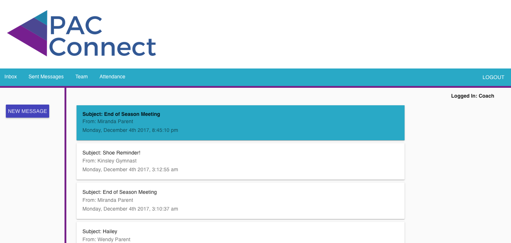
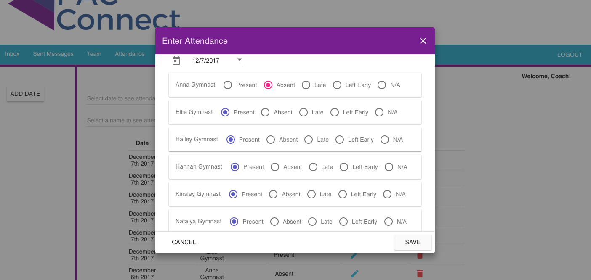

# PAC Connect

PAC Connect is a communication application for the Parent, Athlete, Coach triangle geared specifically towards gymnastics.  It provides a layer of protection to the athlete by aligning with Safe Sport policy and sending copies of messages between the athlete and coach to the parent.  It also provides separation to the coach's personal accounts.  

PAC Connect allows coaches to message their athletes and parent's of athletes on their team.  It also allows the coach to track their team's attendance, filter by date and name.

Parents may send and receive messages to/from the coach.  They can view copies of all messages between their child and coach.  They may also view their child's individual attendance.

Gymnasts may send and receive messages to/from the coach.  They can also view their individual attendance.

## Built With

- PostgreSQL
- Express
- AngularJS 
- Node.js
- Moment.js
- Angular Material for styling
- Passport for user authentication
- FileStack API for sending pictures
- AngularJS Responsive Carousel
- Heroku and  POSTGRES Add-On for web deployment


## Getting Started

These instructions will get you a copy of the project up and running on your local machine for development and testing purposes. See deployment for notes on how to deploy the on a live system.

### Prerequisites

- [Node.js](https://nodejs.org/en/)
- [AngularJS](https://angularjs.org/)
- [PostgreSQL](https://www.postgresql.org/)
- [Express](http://expressjs.com/)
- [Angular Material](https://material.angularjs.org/latest/)

### Installing

Steps to get the development environment running.

In a terminal window, navigate to the project folder once saved on your computer.
- Run `npm install`
- Make sure postgreSQL is running in an open terminal window
- `npm start`

```sql
CREATE TABLE "users" (
	"user_id" serial NOT NULL,
	"name" varchar(80) NOT NULL,
	"user_role" integer(80) NOT NULL,
	"username" varchar(80) NOT NULL UNIQUE,
	"password" varchar(80) NOT NULL,
	"profile" VARCHAR(200) NOT NULL,
	"gym_id" integer(80) NOT NULL,
	"coach_id" integer NOT NULL,
	"parent_id" integer NOT NULL,
	CONSTRAINT users_pk PRIMARY KEY ("user_id")
) WITH (
  OIDS=FALSE
);

CREATE TABLE "user_gymnast" (
	"parent_id" integer NOT NULL,
	"coach_id" integer NOT NULL,
	"gymnast_id" integer NOT NULL,
	CONSTRAINT user_gymnast_pk PRIMARY KEY ("gymnast_id")
) WITH (
  OIDS=FALSE
);

CREATE TABLE "gymnast_properties" (
	"user_id" serial NOT NULL,
	"level" integer NOT NULL,
	CONSTRAINT gymnast_properties_pk PRIMARY KEY ("user_id")
) WITH (
  OIDS=FALSE
);

CREATE TABLE "conversations" (
	"conversation_id" serial NOT NULL,
	"subject" integer NOT NULL,
	"to_user_id" BINARY NOT NULL,
	"from_user_id" BINARY NOT NULL,
	CONSTRAINT conversations_pk PRIMARY KEY ("conversation_id")
) WITH (
  OIDS=FALSE
);

CREATE TABLE "messages" (
	"user_id" integer NOT NULL,
	"conversation_id" integer NOT NULL,
	"date" TIMESTAMP NOT NULL,
	"message" varchar(500) NOT NULL,
	"from_user_id" BINARY NOT NULL,
	"picture_url" VARCHAR(255) NOT NULL,
	"picture_filename" VARCHAR(255) NOT NULL,
	"read" BOOLEAN NOT NULL,
	"parentRead" BOOLEAN NOT NULL
) WITH (
  OIDS=FALSE
);

CREATE TABLE "attendance" (
	"attid" serial NOT NULL,
	"gymnast_id" integer NOT NULL,
	"date" TIMESTAMP NOT NULL,
	"status" varchar NOT NULL,
	CONSTRAINT attendance_pk PRIMARY KEY ("attid")
) WITH (
  OIDS=FALSE
);

ALTER TABLE "conversations" ADD CONSTRAINT "conversations_fk0" FOREIGN KEY ("subject") REFERENCES "users"("user_id");

ALTER TABLE "user_gymnast" ADD CONSTRAINT "user_gymnast_fk0" FOREIGN KEY ("parent_id") REFERENCES "users"("user_id");
ALTER TABLE "user_gymnast" ADD CONSTRAINT "user_gymnast_fk1" FOREIGN KEY ("coach_id") REFERENCES "users"("user_id");
ALTER TABLE "user_gymnast" ADD CONSTRAINT "user_gymnast_fk2" FOREIGN KEY ("gymnast_id") REFERENCES "users"("user_id");

ALTER TABLE "gymnast_properties" ADD CONSTRAINT "gymnast_properties_fk0" FOREIGN KEY ("user_id") REFERENCES "user_gymnast"("gymnast_id");

ALTER TABLE "messages" ADD CONSTRAINT "messages_fk0" FOREIGN KEY ("user_id") REFERENCES "users"("user_id");
ALTER TABLE "messages" ADD CONSTRAINT "messages_fk1" FOREIGN KEY ("conversation_id") REFERENCES "conversations"("conversation_id");

ALTER TABLE "attendance" ADD CONSTRAINT "attendance_fk0" FOREIGN KEY ("gymnast_id") REFERENCES "user_gymnast"("gymnast_id");

```

## Screen Shot





### Completed Features

High level list of items completed.

- [x] Parents can send messages to the coach.
- [x] Athletes can send messages to the coach and a copy is sent to the parent.
- [x] Coaches can send messages to a parent or gymnast.  A copy of messages to the gymnast are sent to their registered parent.
- [x] The ability to reply to a specific message.
- [x] Ability to send pictures via Filestack.
- [x] Attendance tracker for coaches.  Filter by name or date.
- [x] Parents and gymnasts can view their personal attendance.

### Next Steps

- [ ] Ability for coach to add meet results and parents/gymnasts to view their personal results.
- [ ] Charts.js to compare attendance to meets for parents/gymnasts.
- [ ] Complete the ability for sent videos to be viewable by recepient.

## Authors

* Marta Jopp


## Acknowledgments

* Thank you to my instructors Chris Black, Kris Szafranski and Prime Digital Academy
* Thank you to Prime Digital Academy for providing the Passport local strategy code
